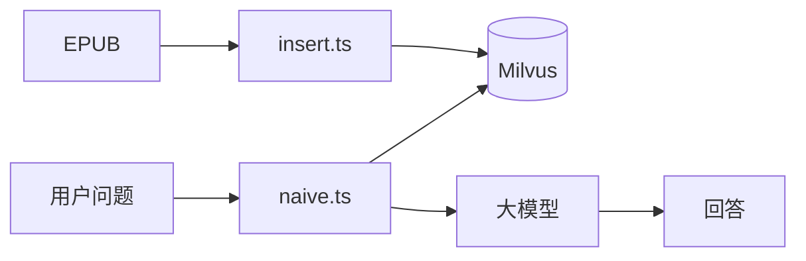

# AI-E-book-Search-Assistant

基于大模型与向量数据库的 **EPUB 电子书检索问答** 项目。支持将小说切块入库，并通过 RAG、多跳检索与 LangGraph 工作流进行智能问答。

## 技术栈

| 类别 | 技术 |
|------|------|
| 语言 | TypeScript、Node.js (ES Module) |
| 编排 | [LangGraph](https://langchain-ai.github.io/langgraph/)、[LangChain](https://js.langchain.com/) |
| 大模型 | OpenAI 兼容 API（如通义千问 `qwen-plus` / `qwen3.5-plus`） |
| Embedding | `text-embedding-v3`（1024 维） |
| 向量库 | [Milvus](https://milvus.io/)（`IVF_FLAT` + `COSINE`） |
| 向量接入 | `@langchain/community` Milvus VectorStore、`@zilliz/milvus2-sdk-node` |
| 文档处理 | EPUB 加载（`EPubLoader`）、`RecursiveCharacterTextSplitter` 文本分块 |
| 校验 / 结构化输出 | Zod、`withStructuredOutput` |
| 配置 | dotenv |

## 功能特性

### 1. 自主决策

使用 **LangGraph** 构建多节点工作流，由模型与规则共同决定执行路径，而非固定「检索 → 生成」流水线。

- **问答路由**：判断 `simple`（直接回答）或 `complex`（进入多跳 RAG）
- **子问题拆解**：将复合问题拆成有序、可独立检索的子问题链
- **检索规划**：根据已检索轮数、剩余子问题、上一轮命中摘要，决定继续 `retrieve` 或进入 `rag_generate`
- **流式生成**：基于累积证据回答用户原始问题

入口：[`src/naive.ts`](src/naive.ts)

### 2. 网络搜索

在电子书向量库之外，可对接 **Web 检索** 补充实时或库外信息（如百科、新闻、补充设定）。适用于向量库未覆盖或需要时效性内容的场景。

> 扩展方向：接入 Tavily / SerpAPI / 自建搜索 API，作为 LangGraph 独立节点，与 Milvus 检索结果合并后生成。

### 3. 关键词搜索

除 **语义向量检索** 外，支持基于 **关键词 / 全文** 的检索方式，提升对人名、地名、专有名词等精确匹配的召回。

- 当前已实现：**向量相似度检索**（`similaritySearchWithScore` / `MilvusClient.search`）
- 扩展方向：Milvus 标量过滤、`book_id` / `chapter_num` 条件查询，或 BM25 + 向量混合检索（Hybrid Search）

### 4. 知识图谱

将书中 **人物、门派、事件、章节** 等抽象为实体与关系，构建知识图谱，用于多跳推理、关系补全与可解释检索。

> 扩展方向：从 EPUB 分块中抽取三元组，写入图数据库（如 Neo4j），与向量检索联动（GraphRAG）。

### 5. RAG 评估

对检索与生成质量进行 **可量化评估**，便于调参（`top-k`、`nprobe`、分块大小）与对比不同策略。

> 扩展方向：召回率 / 命中率、答案忠实度、与子问题覆盖度；可使用 Ragas、自建 LLM-as-judge 或人工标注集。

## 项目结构

```
src/
  insert.ts   # EPUB 解析、分块、向量化写入 Milvus
  query.ts    # 向量检索（Milvus SDK）
  rag.ts      # 检索 + 大模型问答
  naive.ts    # LangGraph：路由、拆解、多跳检索、规划、生成
```

## 快速开始

### 环境要求

- Node.js 18+
- 本地 Milvus（默认 `localhost:19530`）
- OpenAI 兼容 API Key

### 安装

```bash
npm install
```

### 环境变量

在项目根目录创建 `.env`：

```env
OPENAI_BASE_URL=https://your-compatible-endpoint/v1
OPENAI_API_KEY=your-api-key
OPENAI_BASE_MODEL=qwen-plus
OPENAI_STRUCTURED_MODEL=qwen-plus
OPENAI_EMBEDDINGS_MODEL=text-embedding-v3
```

> 结构化输出（路由、拆解、规划）建议使用支持 `functionCalling` / JSON 模式的模型（如 `qwen-plus`）。

### 运行

```bash
# 1. 将 EPUB 入库（需准备 ./天龙八部.epub 或修改 insert.ts 中的路径）
npm run insert

# 2. 纯向量检索
npm run query

# 3. 基础 RAG 问答
npm run rag

# 4. 自主决策 + 多跳 RAG（LangGraph）
npx tsx src/naive.ts
```

编译：

```bash
npm run build
```

## 数据流概览



## License

ISC
